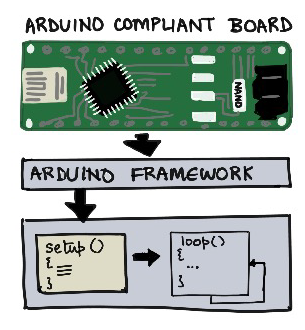
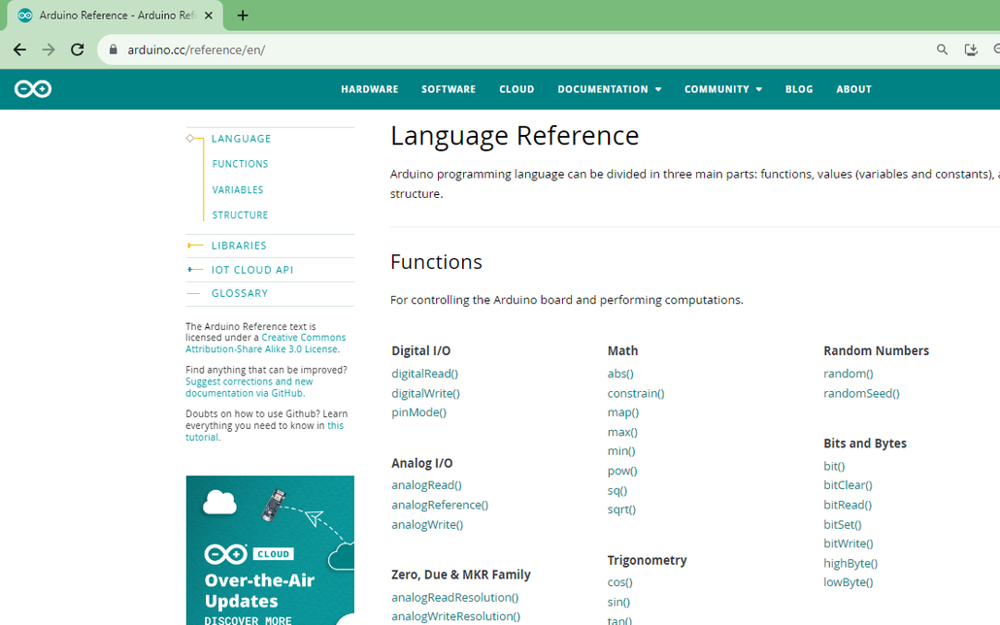
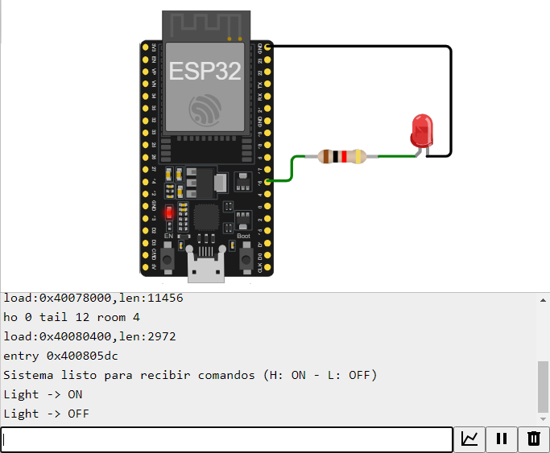

# Componentes basicos de un Sistema IoT


## Objetivos

>* Hacer las primeras pruebas con la placa de desarrollo ESP32
>* Usar circuitos y programas simples con un simulador para la plataforma 

## Referencias principales

1. Lección 2 **A deeper dive into IoT** ([link](https://github.com/microsoft/IoT-For-Beginners/blob/main/1-getting-started/lessons/2-deeper-dive/README.md)) del curso de Microsoft **IoT for Beginners** [[link](https://github.com/microsoft/IoT-For-Beginners)]
2. Lección 3 **Interact with the phisycal world** ([link](https://github.com/microsoft/IoT-For-Beginners/blob/main/1-getting-started/lessons/3-sensors-and-actuators/README.md)) del curso **IoT for Beginners** ([link](https://github.com/microsoft/IoT-For-Beginners)) de Microsoft.

## Simuladores online

La siguiente es una lista de aplicaciones que se usarán para propósitos de simulación. Para usarlas basta con tener una cuenta de correo de google por ejemplo:
- [x] Tinkercad (https://www.tinkercad.com/)
- [x] Wokwi (https://wokwi.com/)

## Trabajo de clase

## 1. Sistemas de desarrollo

El corazón de los sistemas IoT son las cosas. Estas, son las encargadas de permitir la interacción del sistema con el medio ambiente mediante la recolección, el procesamiento de los datos y las acciones de control sobre este. 

Para realizar labores de prototipado se emplean sistemas de desarrollo (dev kits) los cuales son de dos tipos *Microcontroladores* y *Computadoras de placa unica* tal y como se muestra en la siguiente figura:


### Sistemas disponibles en el laboratorio

A continuación se listan algunos sistemas de desarrollo. Los que se encuentran disponibles en el laboratorio estan marcados.

#### Microcontroladores

- [x] Arduino UNO 
- [x] ESP8266 
- [x] ESP32 
- [x] ARDUINO NANO 33 BLE Sense Lite

#### Computadores de una sola placa

- [x]  Raspberry Pi [[link]](https://www.raspberrypi.com/) 
- [ ]  BeagleBoard [[link]](https://www.beagleboard.org/) 
- [ ]  Orange Pi [[link]](http://www.orangepi.org/)  
- [ ]  Banana Pi[[link]](https://www.banana-pi.org/)  
- [ ]  Intel Galileo [[link]](https://ark.intel.com/content/www/us/en/ark/products/78919/intel-galileo-board.html)

> **Para profundizar** <br>
Para conocer mas sobre estos elementos disponibles en el laboratorio consulte el siguiente [link](https://udea-iot.github.io/UdeA_IoT-page/docs/sesiones/percepcion/sesion2)

## 2. Configuración del entorno de desarrollo para microcontroladores

### Arduino framework

Para programar un microcontrolador se necesitan algunas herramientas para desarrollar el software que se ejecutara en el microcontrolador (firmware). Debido a la gran cantidad de microcontroladores existentes, cada fabricante ofrece un framework para facilitar el desarrollo de aplicaciones para cualquier microntrolador compatibles con estos.

Debido a la popularidad y facilidad, en el curso de usará el Framework de Arduino. Arduino es una plataforma de electrónica open source que combina hardware y software lo que lo hace ideal para programar placas no solo exclusivas de Arduino, sino tambien de otros fabricantes usando el modelo de programación empleado en Arduino para desarrollar software.

En este modelo, las placas se programa en C o C++ mediante un archivo de código conocido como **sketch** ([link](https://github.com/microsoft/IoT-For-Beginners/blob/main/1-getting-started/lessons/2-deeper-dive/README.md)):



El **sketch** se compone de dos funciones principales (ver figura tomada del siguiente [link](https://github.com/microsoft/IoT-For-Beginners/blob/main/1-getting-started/lessons/2-deeper-dive/README.md)):
* **`setup`**: Código de inicialización (inicialización de puertos, conexión a la red Wi-Fi, servicios de nube, etc) que se ejecuta cuando se enciende el microcontrolador. 
* **`loop`**: Código que se ejecuta de manera continua mientras el microcontrolador este encendido. Aqui es donde se implementa la logica de la aplicación (lectura de sensores, control de actuadores, envio y recepción de información, etc).

A continuación se muestra una plantilla de código tipica:

```cpp
// Project Name
// Description: Brief description of the project and its functionality

// Include necessary libraries
#include <Arduino.h>


// Define constants and pin assignments


// Global variables

void setup() {
    // Initial setup
    // code...
}

void loop() {
    // Code that runs repeatedly
    // code...
   
}
```

Para desarrollar aplicaciones en dispositivos compatibles con el framework de Arduino, existen varios entornos de desarrollo (IDE), entre los cuales destacan el Arduino IDE y Visual Studio Code, este último utilizado junto con la extensión PlatformIO, que permite el desarrollo de aplicaciones en microcontroladores.

### Configuración del entorno de desarrollo

A lo largo del curso usaremos el Visual Studio Code con Platformio, de modo que el primer paso consiste en realizar la instalación y configuración de la herramienta. En la pagina **Getting Started with VS Code and PlatformIO IDE for ESP32 and ESP8266 (Windows, Mac OS X, Linux Ubuntu)** ([link](https://randomnerdtutorials.com/vs-code-platformio-ide-esp32-esp8266-arduino/)) del sitio **Random Nerd Tutorials** ([link](https://randomnerdtutorials.com/)).

Antes de empezar tenga a la mano un diagrama de pines para es ESP32 tal y como se muestra a continuación:


Asi mismo tenga a la mano los siguientes recursos para consulta rapida:
- [x] Arduino cheat sheet ([link](https://www.cheat-sheets.org/saved-copy/Arduino-cheat-sheet-v02c.pdf)
- [X] Arduino Language Reference ([link](https://www.arduino.cc/reference/en/))
  
  

Para montar los siguientes ejemplos siga los pasos descritos la pagina **Primeros pasos con platformio** ([link](./plaftormio_tutorial))

#### Ejemplo 1

**Descripción**: La siguiente aplicación muestra el encendido y apagado de un led a una frecuencia de 1Hz. 

**Componentes**:

| Item No. | Nombre del componente| Cantidad |
|---|---|---|
|1|ESP32 Development Board|1|
|2|LED (Rojo)|1|
|3|Resistencia 220Ω|1|

**Esquematico**:


**Diagrama de conexión**:


**Código**:

```cpp
// ESP32-blink
// Description: Programa que enciende y apaga led conectado al GPIO2 
// con una frecuencia de 1Hz

// Include necessary libraries
#include <Arduino.h>

// Define constants and pin assignments
#define LED_PIN 2          // P2 (GPIO2)

// Global variables
int delay_ms = 500;

void setup() {
    // Initial setup
    // Port configure
    pinMode(LED_PIN, OUTPUT);    
    digitalWrite(LED_PIN, LOW);
}

void loop() {
    delay(delay_ms);             // Delay 500ms
    digitalWrite(LED_PIN, HIGH); // Led ON
    delay(delay_ms);             // Delay 500ms 
    digitalWrite(LED_PIN, LOW);  // Led OFF
}
```

**Simulación**: La simulación se muestra en el siguiente [link](https://wokwi.com/projects/406255037756300289)


#### Ejemplo 2

**Descripción**: Modifique el ejemplo anterior de tal modo que el encendido y apagado del led dependa de los siguientes comandos enviados via serial.

|Comando|Descripción|
|---|---|
|H|	Comando empleado para encender el Led.|
|L|	Comando empleado para apagar el Led.|


**Componentes**:

| Item No. | Nombre del componente| Cantidad |
|---|---|---|
|1|ESP32 Development Board|1|
|2|LED (Rojo)|1|
|3|Resistencia 220Ω|1|

**Esquematico**:


**Diagrama de conexión**:


**Código**:

```cpp
// ESP32-ledSerial
// Description: Programa en enciende y apaga un led empleando comandos por serial.

// Include necessary libraries
#include <Arduino.h>
/* Entradas y salidas */
#define LIGHT1 16          // P26 (GPIO26)

/* Comandos */
#define LIGHT_ON 'H'       // Luz encendida  
#define LIGHT_OFF 'L'      // Luz apagada  

int cmd = 0; // Comnado entrado por serial

void setup() {
  // Configuración de los puertos digitales
  pinMode(LIGHT1, OUTPUT);    
  digitalWrite(LIGHT1, LOW);
  // Configuracion del puerto serial
  Serial.begin(9600); 
  Serial.println("Sistema listo para recibir comandos (H: ON - L: OFF)");  
  
}

void loop() {
  // reply only when you receive data:
  if (Serial.available() > 0) {
    // read the incoming byte:
    cmd = Serial.read();

    // Encendido o apagado de la luz segun el comando
    if(cmd == LIGHT_ON) {
      digitalWrite(LIGHT1, HIGH);
      Serial.println("Light -> ON");
    }
    else if(cmd == LIGHT_OFF) {
      digitalWrite(LIGHT1, LOW);    
      Serial.println("Light -> OFF");
    } 
  }
}
```

**Simulación**: La simulación se muestra en el siguiente [link](https://wokwi.com/projects/406259527261320193)





## Referencias

* https://how2electronics.com/10-essential-iot-starter-kits-to-kickstart-your-journey/
* https://udea-iot.github.io/UdeA_IoT-page/docs/sensores-actuadores/sensores/intro
* https://gist.github.com/lyqht
* https://github.com/microsoft/IoT-For-Beginners
* https://github.com/microsoft/ML-For-Beginners
* https://github.com/microsoft/Web-Dev-For-Beginners
* https://github.com/microsoft/ai-for-beginners
* https://github.com/microsoft/Data-Science-For-Beginners
