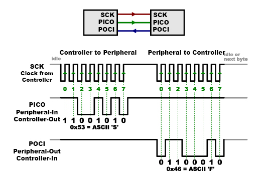
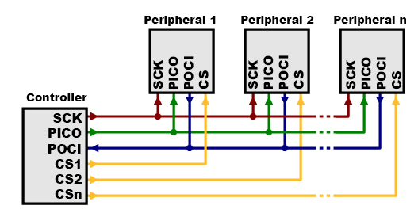

# Protocolo SPI

Este es un protocolo de comunicación entre un MCU (Maestro o Controlador) y uno o varios dispositivos (Esclavos o Periféricos). 
Se caracteriza por ser sincrónico y alcanzar altas velocidades de transferencia de datos (hasta unos 60 Mbps).

## Líneas SPI

* SCK o CLK: Reloj (señal de sincronía)
* MOSI o PICO o DO: Salida del maestro, Entrada del esclavo.
* MISO o POCI o DI: Salida del esclavo, Entrada del maestro.
* /CS o /SS: Línea de selección de esclavo (activa en bajo).

## Conexión Maestro - 1 Esclavo

## Conexión Maestro - Varios Esclavos

## Ejemplos

1. **ESP32: Guide for MicroSD Card Module using Arduino IDE** [[link]](https://randomnerdtutorials.com/esp32-microsd-card-arduino/)
2. **ESP32 – Micro SD Card Interface** [[link]](https://www.instructables.com/ESP32-Micro-SD-Card-Interface/)
3. **wokwi-microsd-card Reference** [[link]](https://docs.wokwi.com/parts/wokwi-microsd-card)
   * [simulacion 1](https://wokwi.com/projects/310542489623724609)
   * [simulacion 2](https://wokwi.com/projects/310692660849410626)
4. **wokwi SPI screen 1** [[link]](https://wokwi.com/projects/389142490169497601)
5. **wokwi SPI screen 2** [[link]](https://wokwi.com/projects/409312856465230849)
6. **wokwi Reference** [[link]](https://docs.wokwi.com/parts/wokwi-ili9341)
   * [simulacion 1](https://wokwi.com/projects/307567201804616256)
   * [simulacion 2](https://wokwi.com/projects/307567963154678338)
   * [simulacion 3](https://wokwi.com/projects/307664460274729536)
   * [simulacion 4](https://wokwi.com/projects/308022099088245312)

## Referencias

* https://learn.sparkfun.com/tutorials/serial-peripheral-interface-spi
* https://learn.adafruit.com/circuitpython-basics-i2c-and-spi/spi-devices
* https://wiki.seeedstudio.com/XIAO-SPI-Communication-Interface/
* https://wiki.seeedstudio.com/Software-SPI/
* https://users.ece.utexas.edu/~valvano/arm/
* https://www.ti.com/es-mx/video/6195424244001
* https://www.dejazzer.com/ee379/labs/lab4_can_i2c.pdf
* https://www.paginaspersonales.unam.mx/app/webroot/files/5190/Asignaturas/1508/Archivo1.2841.pdf
