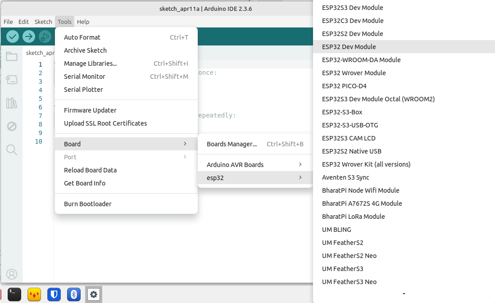
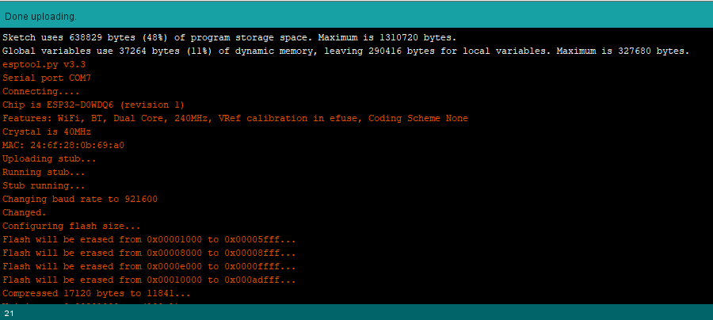
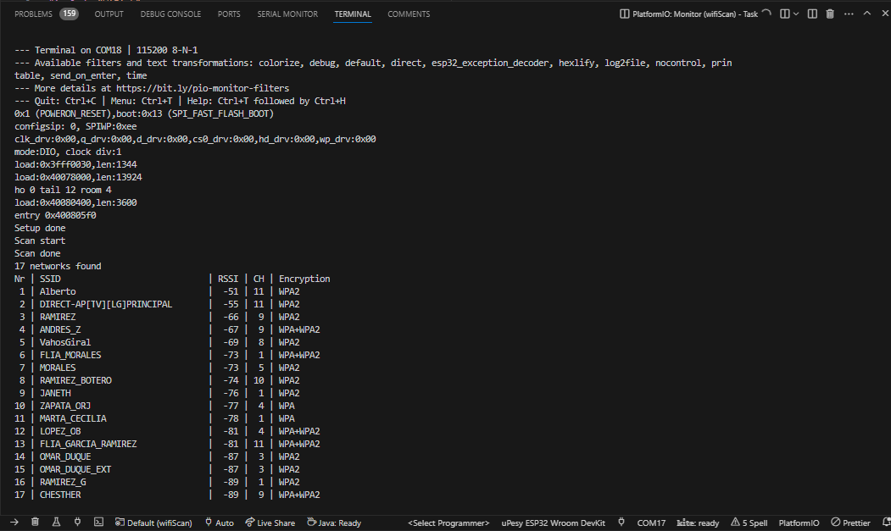
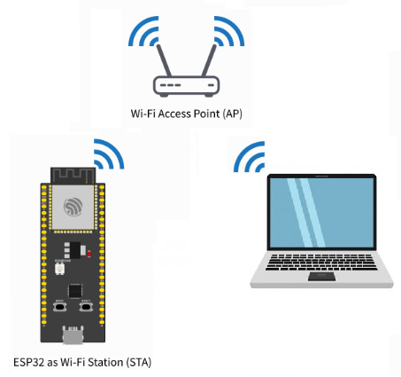

# Conexión wifi para el ESP32

## Objetivos

> * Comprender el proceso de conexión de la placa de desarrollo basada en ESP32 a un red wifi.
> * Entender los diferentes roles de conexión que puede tomar una ESP32.
> * Enviar información de sensado usando servicios

## 1. Antes de empezar

Antes de empezar a trabajar recuerde el proceso de desarrollo para la plataforma ESP32 (visto en las clases anteriores). De tomas maneras, para que tenga información rapida a la mano, le recomendamos las siguientes paginas para que recuerde los primeros pasos con el ESP32:
1. **Getting Started with the ESP32 Development Board** [[link]](https://randomnerdtutorials.com/getting-started-with-esp32/)
2. **ESP32 Pinout Reference: Which GPIO pins should you use?** [[link]](https://randomnerdtutorials.com/esp32-pinout-reference-gpios/)
3. **Installing the ESP32 Board in Arduino IDE (Windows, Mac OS X, Linux)** [[link]](https://randomnerdtutorials.com/installing-the-esp32-board-in-arduino-ide-windows-instructions/)

## 2. Arduino core for the ESP32

Como previamente se habia mencionado, el ESP32 es una evolución del ESP8266. En el laboratorio se cuentan con varios modulos. La siguiente lista resalta algunas referencias de utilidad si lo que se desea es sobre el ESP32:
* **ESP32 - Pagina del fabricante** ([link](https://www.espressif.com/en/products/socs/esp32))
* **ESP-IDF Programming Guide** ([link](https://docs.espressif.com/projects/esp-idf/en/latest/esp32/))
* **Arduino core for the ESP32** ([link](https://espressif.github.io/arduino-esp32/))

En nuestro caso vamos a hacer enfasis en el **Arduino core for the ESP32** ([link](https://espressif.github.io/arduino-esp32/)) que es donde se encuentra toda la información para programar el ESP32 haciendo uso del API de arduino ([link](https://docs.espressif.com/projects/arduino-esp32/en/latest/)). 

Antes de empezar es importante ver las librerias disponibles en el API las cuales se pueden ver en el siguiente [link](https://docs.espressif.com/projects/arduino-esp32/en/latest/libraries.html).


## 3. Arduino core for the ESP32: Wi-Fi API

Como en nuestro caso, lo que nos interesa es analizar como se puede conectar el ESP32 a una red WiFi, la información mas relevante se encuentra en [Wi-Fi API](https://docs.espressif.com/projects/arduino-esp32/en/latest/api/wifi.html) asi que nos concentraremos en dar una vista rapida de este antes de poner algunos ejemplos.

Sobre el API, en la pagina se menciona:

> ### **About**
> The Wi-Fi API provides support for the 802 11b/g/n protocol driver. This API includes:
> * Station mode (STA mode or Wi-Fi client mode)ESP32 connects to an access point 
> * AP mode (aka Soft-AP mode or Access Point mode) Devices connect to the ESP32
> * Security modes (WPA, WPA2, WEP, etc).
> * Scanning for access points

Como punto de partida básico es bueno recordar los roles que puede tomar el ESP32 dentro de una red Wi-Fi:
* **Access Point (AP)**: En este modo, el ESP32 es configurado como un access point (AP) permitiendo la conexión entre los otros dispositivos (Stations) de la red.
 


* **Station (STA)**: En este caso, el ESP32 se conecta, como cualquier otro dispositivo, a la red Wi-Fi a traves de un Access Point.
 


## 3. Primeros pasos

### 3.1. Prueba de conectividad

Antes de empezar, lo primero que debemos realizar es una prueba basica para verificar el Wi-Fi del modulo **NodeMCU-32S**. De modo que siga los siguientes pasos:
1. Abra el Arduino IDE.
2. Seleccione la placa (**Tools > Board > ESP32 Arduino > NodeMCU-32s**).
   
   

3. Conecte el modulo NodeMCU-32S al PC.

4. Seleccione el puerto.
   
   

5. En la sección de ejemplos (**examples**) busque los ejemplos relacionados con el **ESP31-DevKit** y busque el que dice **WifiScan**,asi: **File > Examples > Wifi > WiFiScann**)
   
   
   
6. Compile y descargue el ejemplo a la tarjeta. A diferencia de las otras tarjetas, antes de proceder a la descarga del firmware, en este caso debe dejar presionado el boton **1OO** de la tarjeta y liberarlo apenas aparezca el mensaje ```Connecting...``` en los mensajes de la consola de descarga (Para mas infromación ver: [Getting Started with the ESP32 Development Board](https://randomnerdtutorials.com/getting-started-with-esp32/)):
   
   

7. Probar el ejemplo configurando la terminal serial en mismo valor que aparece en el codigo del programa (115200 para este caso). Si todo esta bien, saldrá en el monitor serial la información de las redes Wi-Fi disponibles tal y como se muestra a continuación:
   
   

   El resultado de realizar el scaneo en platformio se muestra en la siguiente figura: 
   
   

> **Simulación Online** </br>
> * Un ejemplo del WiFi Scan se muestra en la pagina de Wokwi en el siguiente [link](https://wokwi.com/projects/305569599398609473)
> * El archivo para scanear los access points disponibles se encuentra adaptado en platformio se define en los archivos ([main.cpp](main.cpp) y [platformio.ini](platformio.ini)).

### 3.2. Librerias Wifi

Para hacer posible una conexión empleando Wifi, es necesario contar con un **Access Point (AP)**. Un **AP** es un dispositivo que permite la conexión de dispositivos Wi-Fi a una red cableada tal y como se muestra en la siguiente figura:


Para permitir la conexión de una placa Arduino a un red wifi se emplea el **Arduino WiFi**. Esto es posible gracias a la libreria **WiFi** ([link](https://www.arduino.cc/en/Reference/WiFi)) (la cual viene incluida en el Arduino IDE).
A continuación se muestran las clases de mayor uso de esta libreria:

#### Clase `WiFi` 
La clase WiFi inicializa la biblioteca de ethernet y la configuración de red. La siguiente tabla muestra algunos de los principales métodos:

|Método|Descripción|Sintaxis|
|---|---|---|
|```WiFi.begin()```|Inicializa la configuración de red de la biblioteca WiFi y proporciona el estado actual|```WiFi.begin();``` <br> ```WiFi.begin(ssid);``` <br> ```WiFi.begin(ssid, pass);``` 
|```WiFi.disconnect()```|Desconecta la placa WiFi de la red actual.|```WiFi.disconnect();```|
|```WiFi.status()```|Devuelve el estado de la conexión (```WL_CONNECTED```, ```WL_CONNECTION_LOST```, ```WL_DISCONNECTED``` y ```WL_CONNECT_FAILED``` entre otros).|```WiFi.status();```|


#### Clase `IPAddress` 

La clase ```IPAddress``` proporciona información sobre la configuración de la red. La siguiente tabla muestra los métodos de la clase ```Wifi``` que son empleados con esta clase:

|Método|Descripción|Sintaxis|
|---|---|---|
|```WiFi.localIP()```|Obtiene la dirección IP de la placa WiFi.|```WiFi.localIP();```|
|```WiFi.subnetMask()```|Obtiene la mascara de subred de la placa WiFi.|```WiFi.subnetMask();```|
|```WiFi.gatewayIP()```|Obtiene la dirección IP de la puerta de enlace de la placa WiFi.|```WiFi.gatewayIP();```|

#### Clase `Server`

La clase Server crea servidores que pueden enviar y recibir datos de clientes conectados (programas que se ejecutan en otras computadoras o dispositivos). Esta clase, es la clase base de Wifi Server. Para su instanciación se emplea el siguiente constructor:

|Clase|Descripción|Sintaxis del constructor|
|---|---|---|
|```WiFiServer```|Crea un servidor que escucha las conexiones entrantes en el puerto especificado.|```Server(port);```|

A continuación se resumen algunos de los principales métodos asociados a esta clase.

|Método|Descripción|Sintaxis|
|---|---|---|
|```begin()```|Le dice al servidor que comience a escuchar las conexiones entrantes.|```server.begin();```|

#### Clase `Client`

La clase client crea clientes que pueden conectarse a servidores y enviar y recibir datos.

|Método|Descripción|Sintaxis|
|---|---|---|
|```WiFiClient()```|Crea un cliente que puede conectarse a una dirección IP y un puerto de Internet especificados como se define en ```client.connect()```.|```WiFiClient();```|
|```connected()```|Determina si el cliente está conectado o no |```client.connected();```|

Debido al uso masivo del ESP8266, se creo una libreria WiFi (la cual trata de conservar la filosofia de la libreria original para Arduino) para esta plataforma. Para consultar mas sobre esta libreria puede dirigirse a la sección del [ESP8266WiFi library](https://arduino-esp8266.readthedocs.io/en/latest/esp8266wifi/readme.html) API de [ESP8266 Arduino Core](https://arduino-esp8266.readthedocs.io/en/latest/index.html).

Para mayor información puede consultar:
1. [Arduino WiFi library](https://www.arduino.cc/en/Reference/WiFi)
2. [ESP8266 Arduino Core’s](https://arduino-esp8266.readthedocs.io/en/latest/index.html)
3. [ESP8266 Arduino Core’s en español](https://esp8266-arduino-spanish.readthedocs.io/es/latest/#)

## 4. Ejemplos

### 4.1. Ejemplos parte 1

1. Crear una red local compuesta por los siguientes elementos:

   

   El papel de cada uno de los dispositivos involucrados se muestra a continuación:

   |Dispositivo | Rol|Descripción|
   |---|---|---|
   |ESP32 |Access point (AP)|Permitira creación de la red local interna para conectar a traves de Wifi todos los dispostivos pertenecientes a esta red|
   |Computador |Cliente|Será empleado como cliente con el fin de enviar peticiones al servidor (implementado en la ESP32)|
   |ESP32|Servidor (STA)| Ejecurara un servidor que permitira pender y apagar remotamente un led al responder a las peticiones recibidas desde el cliente|

   **Procedimiento**: El procedimiento se describe en el [ejemplo1](./ejemplo1/README.md)

2. Este es una variación del ejemplo anterior la cual consiste en agregar los dispositivos en una red ya disponible (como la del LIS por ejemplo). En este caso, solo se usará el ESP32 que hace de servidor y un pc (portatil y telefono movil) como cliente tal y como se muestra en la siguiente figura:
   
   

   El rol de los dispositivos implicados se muestra a continuación:

   |Dispositivo|Rol|Descripción|
   |---|---|---|
   |Computador |Cliente|Será empleado como cliente con el fin de enviar peticiones al servidor (implementado en la ESP32)|
   |ESP32|Servidor (STA)| Ejecurara un servidor que permitira pender y apagar remotamente un led al responder a las peticiones recibidas desde el cliente|

   **Procedimiento**: El procedimiento se describe en el [ejemplo 2](./ejemplo2/README.md)

3. En este ejemplo se replica el ejemplo **ESP32 Web Server – Arduino IDE** de Random Nerd Tutorials ([link](https://randomnerdtutorials.com/esp32-web-server-arduino-ide/)).
   
   **Procedimiento**: El procedimiento se describe en el [ejemplo 3](./ejemplo3/README.md)

4. Este ejemplo es una adaptación de un ejemplo de la guia **ESP32 Thing Hookup Guide** de Sparkfun ([link](https://learn.sparkfun.com/tutorials/esp32-thing-hookup-guide/)). Mas exactamente el ejemplo adaptado es el de la sección **Arduino Example: WiFi** ([link](https://github.com/UdeA-IoT/ejemplos-wifi/tree/main/ejemplo4))
   
   **Procedimiento**: El procedimiento se describe en el [ejemplo 4](./ejemplo4/README.md)

En todos los ejemplos anteriores, hemos visto el ESP32 funcionando como **Servidor**. A continuación veremos algunos ejemplos en los cuales el ESP32 toma un rol mas activo cuando es un cliente.

## 5. Enlaces

* https://docs.espressif.com/projects/esp-idf/en/latest/esp32/
* https://www.espressif.com/en/products/socs/esp32
* https://docs.platformio.org/en/stable/boards/espressif32/nodemcu-32s.html
* https://docs.espressif.com/projects/arduino-esp32/en/latest/
* https://randomnerdtutorials.com/installing-the-esp32-board-in-arduino-ide-windows-instructions/
* https://docs.espressif.com/projects/espressif-esp-iot-solution/en/latest/index.html
* https://espressif.github.io/arduino-esp32/
* https://docs.espressif.com/projects/arduino-esp32/en/latest/libraries.html
* https://docs.espressif.com/projects/arduino-esp32/en/latest/libraries.html* 
* https://docs.espressif.com/projects/arduino-esp32/en/latest/api/wifi.html
* https://pygmalion.tech/tutoriales/robotica-basica/tutorial-camara-termica-amg8833/
* https://pygmalion.tech/tutoriales/
* https://esp32.com/
* https://www.espressif.com/en/products/socs/esp32/resources
* https://github.com/espressif
* https://blynk.io/
* https://docs.espressif.com/projects/arduino-esp32/en/latest/libraries.html
* https://github.com/UdeA-IoT/actividad-6
* https://github.com/tamberg/fhnw-iot
* https://www.networkworld.com/article/3133738/dweetio-a-simple-effective-messaging-service-for-the-internet-of-things.html
* https://www.learnrobotics.org/blog/nodemcu-dweet-io-freeboard-io-tutorial-for-iot/
* https://docs.iotify.io/temp/untitled-4
* https://github.com/Freeboard/freeboard
